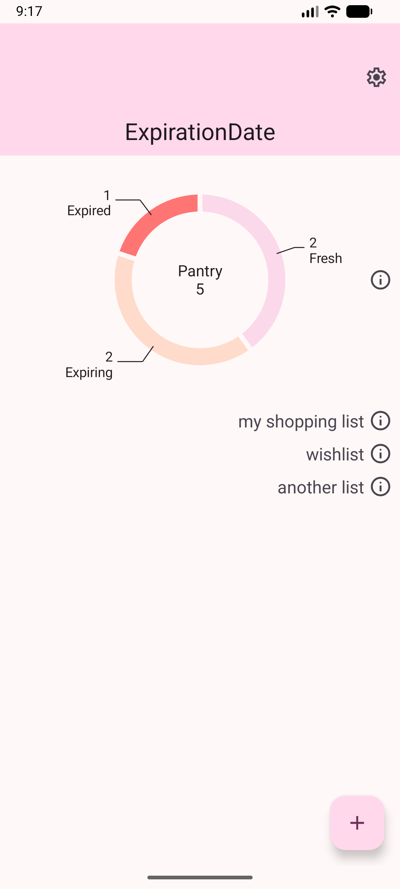
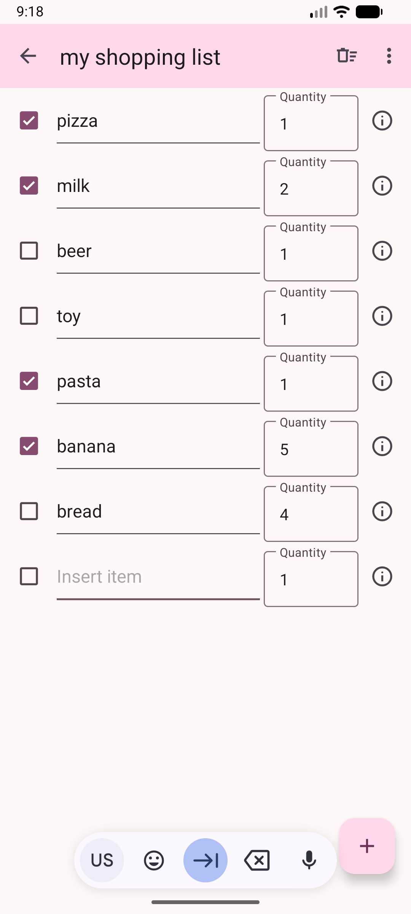
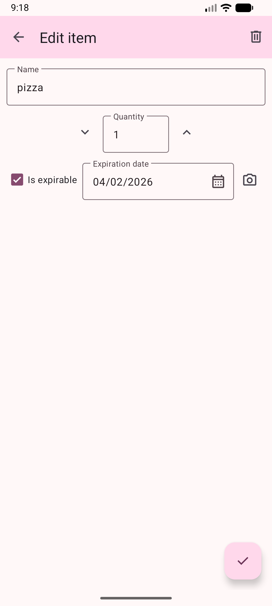
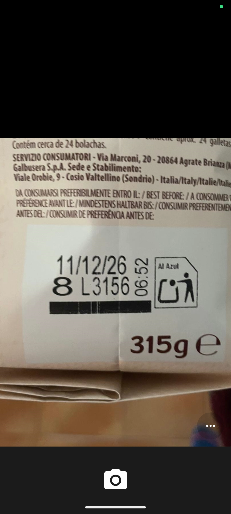

# ExpirationDate
**ExpirationDate** is an Android mobile application which simplifies **shopping list** and **expiration date management**.  
Here are the main features of this app:
- **Notification** for close expiry dates
- **AI-backed** expiry date recognition
- shopping list **autosave**
- customizable **app settings**

## App gallery

## Credits
Expiration Date features date detection model from **krishuggingface**: [Hugging Face](https://huggingface.co/krishuggingface/Expiry_Date_Detection/tree/main).  
It is possible to find the detection mode license at [LICENSE_detection-model.md](LICENSE_detection-model.md).  
